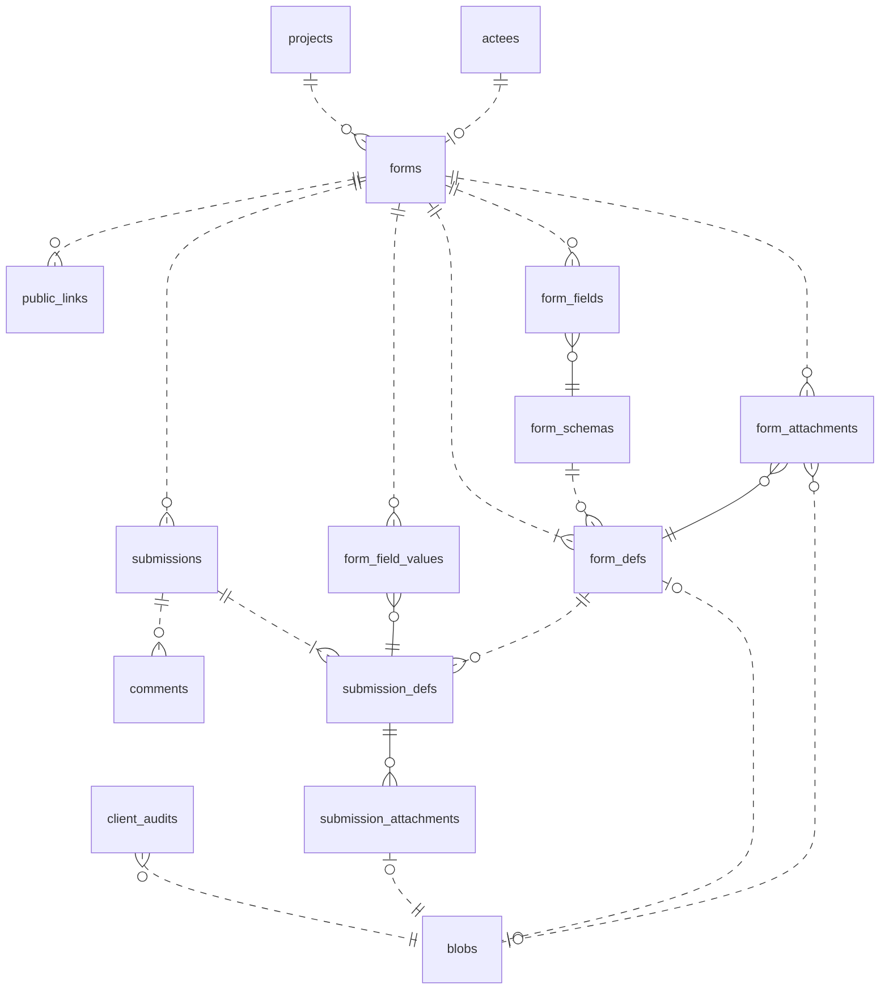
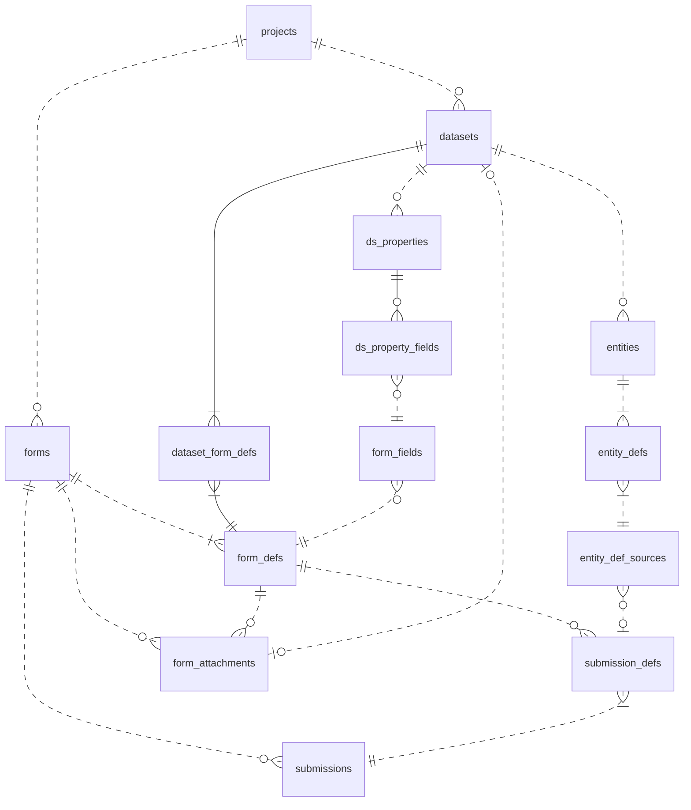

# Database Design

>This document is strictly intended for the developers who want to contribute to ODK central source code. If you are looking to integrate with ODK Central or automate your workflow, please refer to [API documentation](https://odkcentral.docs.apiary.io/#) or [pyODK](https://github.com/getodk/pyodk).

ODK Central uses PostgreSQL database to store information.

**Code Style & Preference:**
- Table names are lower snake case and pluralized
- Column names are camel case
- Data type of primary keys is auto-incrementing integer `serial4`, except for table having composite primary keys
- We have not used database views yet
- We try to do most of the data validation at the database level, that's why we have few triggers like `check_email`, `check_state`, etc
- For datetime columns, we use millisecond precision (`timestamptz(3)`).

There are more than 30 tables in Central database. In this document, we have divided the database into separate "Focus areas" so that it is easier to understand purpose of each table and the relationships amongst them.

 _Note: The diagrams below have actual table names in the boxes but in the description, I have used entity nouns and put table name in the brackets where necessary_

## Forms and Submissions:

Forms and Submissions are the core part of ODK Central. Above ER Diagram shows how we store Forms, Submissions and everything that is related to them in the database. 

- A Project can have many Forms.
- A Form is an Actee, which mean some action can be performed on it.
- Each Form has one or more Definitions (form_defs) to support multiple versions. We keep form definition in  XForm (XML) format in a single column of form_defs table. If XLSForm was uploaded then .XLS file is kept in Blobs (blobs) table.
- Each Form can have Fields (form_fields) i.e. questions, notes, etc.
- Form Definition (form_defs) has a Form Schema (form_schemas), which contains the Fields (form_fields). We introduced Form Schema (form_schemas) to eliminate duplication of Fields when two continuous versions of a Form has the same set of questions with the same ordering and structure.
- A Form can have Attachments (form_attachments) like images, video, audio and data.
- A Form can have Public Links (public_links) that allow anonymous users make Submissions against it.
- A Form can receive Submissions.
- A Submission has one or more Definitions (submission_defs) to support multiple versions. We keep submission XML in a single column of submission_defs table.
- A Submission can have Field Values (`form_field_values`). The values here are used to determine the shape of the normalized selectMultiple representation. They appear, for instance, when selecting the _Split “select multiple” choices into columns_ option for CSV exports — in the CSV, they will not appear as _values_, but as _column headers_ that a submission's multiple choice field values are then scored against (0/1).
  In other words, these values are used to determine the choice options appearing as those column headers.
  The alternative to extracting these values from submissions would be to use _all_ possible choice values (as extracted from eg the form's primary/secondary instances), but that could then amount to thousands of options, and a very wide CSV indeed…
- A Submission can have Attachments (submission_attachments) like images, audio, video and data. Associated binary file is store in Blobs (blobs) table.
- A Submission can hava a Client Audit (client_audits), which is a data file containing timestamped logs of user actions on client application (ODK Collect / Enketo). The data file is received as Submission Attachment, the file is stored in Blobs (blobs) table and each log entry is inserted into Client Audit (client_audits) table.
- A Submission can have Comments

PS: You can think of `*_def` tables as history/version tables.

## Datasets and Entities:

Datasets and Entities are the latest additions to ODK Central, the feature is still in alpha. The purpose here is to achieve longitudinal surveys and case management. 

- A Project can have Datasets.
- A Dataset can have Properties (ds_properties).
- A Property can be filled by Form Fields (form_fields). The relationship between Dataset Property and Form Field is many-to-many, hence resolved in ds_property_fields table.
- A Dataset can be populated by Forms. The relationship between Dataset and Form is many-to-many. Since Form can have multiple Definitions and each Definition can have different Dataset XML schema, we use form_defs table to represent Form side of the relationship and resolve the relationship in dataset_form_defs table.
- A Dataset can have Entities.
- Each Entity has one or more Definitions (entity_defs). We store Definition of an Entity as JSON Blob in a single column of entity_defs.
- An Entity can be created by a Submission or by API, we keep the source of Entity in Entity Definition Source (entity_def_sources).
- A Dataset can be used as a source of data for the Form Attachments in one or more "follow-up" Forms. A Form Attachment can be linked to either a Blob (.csv file uploaded by the user) or a Dataset.

## User Rights Management:

This area of the database deals with the users, their access rights and audit logs.At the center of user management, we have Actors. An Actor is a generic reference to someone who can take action, represented by a User, Public Link, or Field Key.

- A User is an Actor.
- A Public Link (public_links) is an Actor, it is generated for anonymous submission through Enketo (web).
- A Field Key (field_keys) is an Actor, it is generated for an ODK Collect App User.
- An Actor can create Entities.
- An Actor can have HTTP Sessions (sessions). We keep session IDs in the database to support distributed application instances.
- An Actor can make Comments on Submissions.
- An Actor can create Submissions and its Definitions (submission_def).
- An Actor is assigned a Role on an Actee. It is a three way many-to-many relationship, resolved in assignments table.
- An Actor can perform actions on the Actees, the action is logged in Audits (audits) table
- Actees table contains autogenerated UUID for different species (entities as in Entity-Relationship) of the database like Projects, Forms, Users, etc. This is a clever way to handle access management that allow us to know the permissions of an user without having to join all the tables to Assignments table. Additionally we keep audit logs using actee ID, so that even if original object of that actee is deleted we can trace the history.

## Other tables:

These are few stand-alone tables. 

- `configs` table hold different application configurations related analytics, backups, etc
- `knex_migrations` and `knex_migrations_lock` are used internally by Knex.js for keeping database migrations history.
